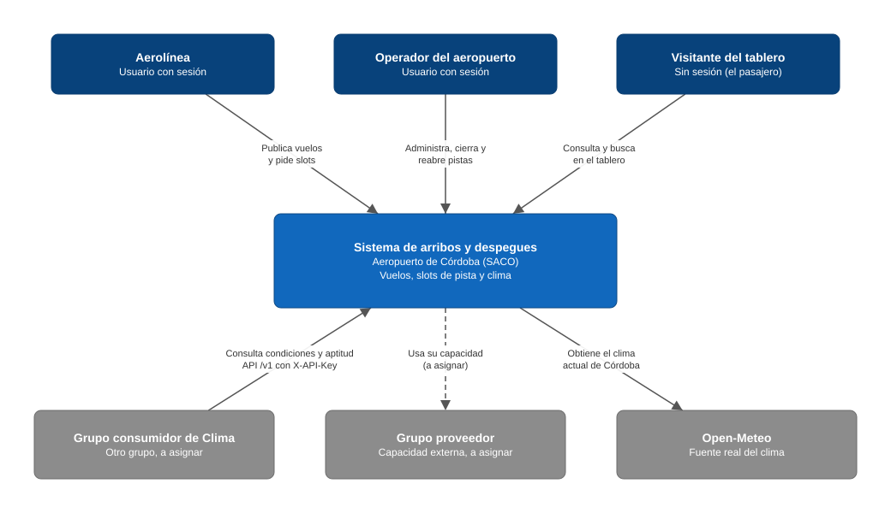
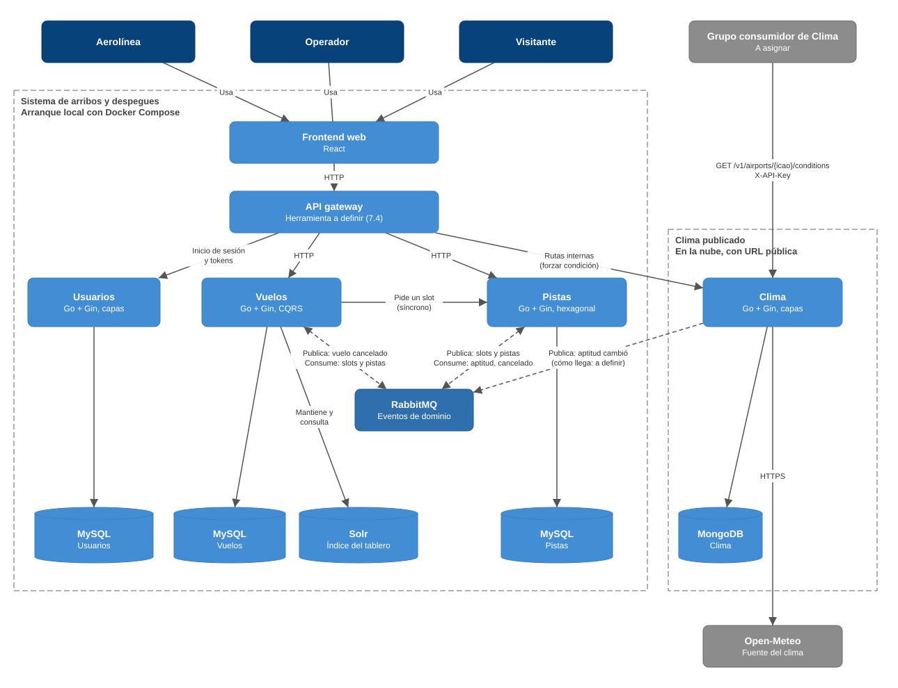

# Arquitectura

Cómo está armado el sistema: qué servicios tiene, de qué se ocupa cada uno, qué datos guarda, cómo se comunican y dónde corre cada pieza.

Todo lo que se describe acá sale de [decisiones.md](decisiones.md) y de los ADR en [adr/](adr/). Lo que todavía no está decidido figura como "a definir" y se junta en [Pendiente](#pendiente).

## El sistema, en un párrafo

Un sistema para administrar los arribos y despegues del aeropuerto de Córdoba (`SACO`). Las aerolíneas publican sus vuelos y piden un slot de pista para cada uno; el operador del aeropuerto administra las pistas; cualquiera puede ver el tablero de arribos y partidas. El clima puede cerrar las pistas, y eso demora los despegues y desvía los arribos. El servicio de clima es, además, la capacidad que publicamos para otro grupo.

El alcance, las reglas de negocio y los criterios de aceptación están en [SPEC.md](../SPEC.md).

## Diagrama de contexto

El sistema visto como una sola caja: quién lo usa y con qué sistemas externos habla.

| Quién | Qué hace con el sistema |
|---|---|
| **Aerolínea** | Inicia sesión, publica sus arribos y despegues y pide un slot para cada uno. |
| **Operador del aeropuerto** | Inicia sesión, administra las pistas, las cierra y las reabre a mano, y puede forzar una condición de clima. |
| **Visitante del tablero** | Consulta y busca en el tablero sin iniciar sesión. Es el caso del pasajero. |
| **Grupo consumidor de Clima** | Otro grupo de la materia, todavía no asignado. Consulta las condiciones y la aptitud de Córdoba con el contrato de [contracts/](contracts/README.md). |
| **Grupo proveedor** | Otro grupo, todavía no asignado, cuya capacidad usamos en un flujo importante. |
| **Open-Meteo** | La fuente real del clima (decisión 6.8). |

## Diagrama de contenedores

Las piezas que corren por separado y cómo se conectan. Las líneas punteadas son eventos por RabbitMQ; las continuas, llamadas directas.

| Contenedor | Tecnología | Para qué está |
|---|---|---|
| Frontend web | React | La interfaz de la aerolínea, el operador y el visitante. Todo lo que hacen pasa por acá. |
| API gateway | A definir (7.4) | Punto de entrada único del frontend: autenticación, direccionamiento y control de tráfico. Valida los tokens que entrega Usuarios (3.3). |
| Vuelos | Go con Gin | Ver [Servicios](#servicios). |
| Pistas | Go con Gin | Ver [Servicios](#servicios). |
| Clima | Go con Gin | Ver [Servicios](#servicios). |
| Usuarios | Go con Gin | Ver [Servicios](#servicios). |
| MySQL de Vuelos, de Pistas y de Usuarios | MySQL | Una instancia por servicio (5.2, ADR-003). |
| MongoDB de Clima | MongoDB | Observaciones y aptitud del aeropuerto (ADR-003). |
| Índice del tablero | Solr | Búsqueda del tablero. Lo mantiene Vuelos a partir de eventos (3.2). |
| Mensajería | RabbitMQ | Eventos de dominio entre servicios (ADR-005). |

Los diagramas son archivos `.drawio.svg`: GitHub los muestra como imagen y se editan abriéndolos con [draw.io](https://app.diagrams.net) o con la extensión "Draw.io Integration" de VS Code.

## Servicios

Son cuatro, más el API gateway. Ningún servicio lee ni escribe la base de otro (3.1). El porqué de estos límites está en el [ADR-001](adr/ADR-001.md).

| Servicio | Qué hace | De qué es dueño | Qué guarda de los otros | Organización interna |
|---|---|---|---|---|
| **Vuelos** | Publicar arribos y despegues, seguir su estado y buscarlos en el tablero. | Datos del vuelo: tipo de operación, aerolínea, origen, destino, horario, estado. | El identificador del slot asignado. | CQRS |
| **Pistas** | Asignar slots de aterrizaje y de despegue sin que se pisen. Cerrar y reabrir pistas. | Pistas, bloques de tiempo y qué vuelo ocupa cada uno. | El identificador del vuelo, su tipo de operación y la última aptitud informada por Clima. | Hexagonal |
| **Clima** | Informar las condiciones y si se puede operar. Es lo que se publica. | Observaciones de clima y umbrales de aptitud. | Nada. | Capas |
| **Usuarios** | Guardar los usuarios y entregar los tokens. | Usuarios y credenciales. | Nada. | Capas |

Las organizaciones internas son las decisiones 7.3 (Vuelos, Pistas y Clima) y 7.5 (Usuarios). Las carpetas de cada servicio están descritas en el `README.md` de su carpeta en [services/](../services/).

## Datos

Cada servicio levanta su propio servidor de base de datos (5.2). El detalle está en el [ADR-003](adr/ADR-003.md).

| Servicio | Almacenamiento | Por qué |
|---|---|---|
| Vuelos | MySQL | Estados y transiciones con estructura fija. |
| Pistas | MySQL | "Un slot, un solo vuelo" se apoya en una restricción única de la base. |
| Clima | MongoDB | Muchas observaciones, sin relaciones entre sí. |
| Usuarios | MySQL (5.3) | Forma fija y nombre de usuario que no se puede repetir. |

Solr guarda una copia derivada de los vuelos para el tablero; no es fuente de verdad. Entre servicios no hay claves foráneas: lo que un servicio sabe de otro (por ejemplo, el slot de un vuelo) le llega por eventos, y puede estar desactualizado por un momento.

## Comunicación

El detalle, con timeouts, reintentos e idempotencia, está en el [ADR-005](adr/ADR-005.md).

**Llamada directa.** Hay una sola entre servicios propios: Vuelos le pide a Pistas un slot exacto y espera la respuesta (4.1). Además, el frontend llega a cada servicio a través del gateway.

**Eventos.** Todo lo demás se avisa por RabbitMQ, publicado con Transactional Outbox (4.4):

| Evento | Lo publica | Lo recibe |
|---|---|---|
| Slot asignado | Pistas | Vuelos |
| Slot liberado por cierre | Pistas | Vuelos |
| Slot cedido a un arribo | Pistas | Vuelos |
| Pista cerrada / reabierta | Pistas | Vuelos |
| Aptitud operativa cambió | Clima | Pistas |
| Vuelo cancelado | Vuelos | Pistas |

**Hacia afuera.** El grupo consumidor llama a Clima con `GET /v1/airports/{icao}/conditions` y su clave en `X-API-Key` (ADR-008). Cuando consumamos la capacidad del grupo proveedor, la llamada va a salir del servicio dueño de la funcionalidad que la usa, nunca del frontend ni del gateway (enunciado, sección 4).

### Flujo principal: publicar un vuelo

1. La aerolínea publica un vuelo desde el frontend. El pedido pasa por el gateway, que valida su token, y llega a Vuelos.
2. Vuelos guarda el vuelo como "pendiente de slot".
3. Vuelos le pide a Pistas el slot elegido, con una llamada directa.
4. Pistas lo asigna si está libre y guarda el evento "slot asignado" en la misma transacción.
5. El relay de Pistas publica el evento en RabbitMQ.
6. Vuelos lo consume, pasa el vuelo a "programado" y actualiza el índice del tablero.

Si Pistas no responde, el vuelo queda "pendiente de slot" y la aerolínea puede volver a pedir.

## Distribución

**Arranque local.** Todo el sistema se levanta con Docker Compose ([docker-compose.yml](../docker-compose.yml)): los cuatro servicios, tres MySQL, un MongoDB, Solr y RabbitMQ. El frontend y el gateway todavía no están en el archivo.

**Clima en la nube.** El enunciado pide que la capacidad publicada esté en la nube con una URL pública. El grupo consumidor entra **directo a Clima**, sin pasar por nuestro gateway: Clima ya autentica con su propia clave y tiene su propio límite de pedidos (ADR-008), y así no hace falta desplegar el gateway en la nube. El gateway queda como punto de entrada único de nuestros usuarios. *Decidido por Carola el 8/10/2026; el equipo lo confirma en el pull request de este documento.*

**Balanceo.** El balanceador es NGINX (7.2). Qué servicio se balancea se decide en la Entrega 2 (D12), por eso no figura en el diagrama.

## Pendiente

- **API gateway:** con qué se hace (7.4, consultado al profe).
- **Punto de entrada único:** confirmar con el profe que la API pública de Clima puede no pasar por el gateway (enunciado, 2.1).
- **Clima en la nube y el resto local:** si el Clima de la nube es el mismo que usa nuestro sistema o una copia aparte, y cómo le llega a Pistas el evento "aptitud cambió" en cada caso.
- **Hosting de Clima:** qué proveedor (7.2).
- **Grupo proveedor:** qué capacidad consumimos, desde qué servicio y en qué flujo (F-19).
- **Caché:** Redis o Memcached, y dónde va (7.2, D7).
- **Balanceo:** qué servicio (D12).
- **Limitaciones conocidas y deuda técnica aceptada:** sección que se agrega para la presentación.
